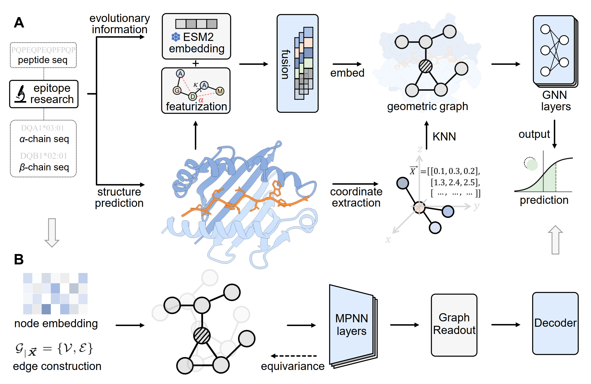

# GeoMHCII



We propose GeoMHCII, a novel geometric deep learning framework designed for pan-specific MHCII peptide interaction predictions. Our method utilizes structural augmentations generated by co-folding models and evolutionary guidance from pretrained protein language models, enabling robust and generalizable modeling of pMHCII interactions. The model is implemented using the ``proteinworkshop`` package. (https://github.com/a-r-j/ProteinWorkshop)


### Requirements
```
pip install -e .
pip install torch==2.5.1 torchvision==0.20.1 torchaudio==2.5.1
workshop install pyg
```

### Settings
Please set the project path in ``.env``, download the ESM2 parameters in ``ROOT_DIR/esm/`` and put pMHCII data in ``DATA_PATH`` before training. 

### Training
```
python src/train.py dataset=mhcii encoder=geomhcii features=ca_bb trainer=gpu
```

### Evaluation
```
python src/test.py dataset=mhcii encoder=geomhcii ckpt_path=path/to/your.ckpt
```
